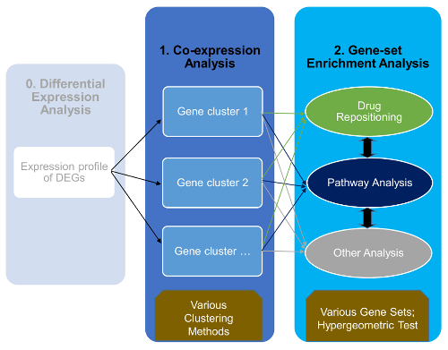

# cogena

```{r setup, include=FALSE}
library("badger")
```

```{r, echo = FALSE, results='asis'}
cat(
    badge_bioc_release("cogena", "green"),
	badge_bioc_download("cogena", "total", "blue", "total"),
	badge_github_actions()
)
```


 [](http://bioconductor.org/packages/cogena) [](http://github.com/zhilnogjia/cogena) [](https://www.bioconductor.org/packages/devel/bioc/html/cogena.html#since) [](http://www.bioconductor.org/packages/devel/bioc/html/cogena.html)
[](https://anaconda.org/bioconda/bioconductor-cogena/badges)
[](https://bioconductor.org/packages/stats/bioc/cogena)

## Introduction
To discovery smaller scale, but highly correlated cellular events that may be of great biological relevance, co-expressed gene set enrichment analysis, cogena, aims to cluster gene expression profiles (coExp) for gene co-expression analysis and then implement enrichment analysis for each clusters (clEnrich) based on hyper-geometric test. The results can be visulised by heatmapCluster and heatmapPEI. Based on different gene sets used, cogena can be used as a tool for pathway analysis, GO enrichment analysis, drug repositioning and so on. See [vignette](http://bioconductor.org/packages/devel/bioc/vignettes/cogena/inst/doc/cogena-vignette_html.html) for the detailed workflow. 

The version of cogena at github is also availiable at [Bioconductor](http://www.bioconductor.org/packages/devel/bioc/html/cogena.html) (development version)


## The workflow of cogena


## Installation
devtools::install_github("zhilongjia/cogena")

## Help
[cogena in Biostars](https://www.biostars.org/p/137330/)


## Citation
[Jia, Zhilong, et al. "Cogena, a novel tool for co-expressed gene-set enrichment analysis, applied to drug repositioning and drug mode of action discovery." BMC Genomics 17.1 (2016): 1.](http://bmcgenomics.biomedcentral.com/articles/10.1186/s12864-016-2737-8)


## Acknowledgement
cogena was originally based on the [clValid](http://cran.r-project.org/web/packages/clValid/index.html) package.

