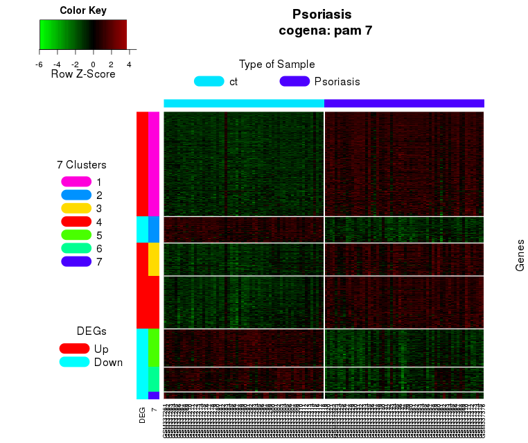
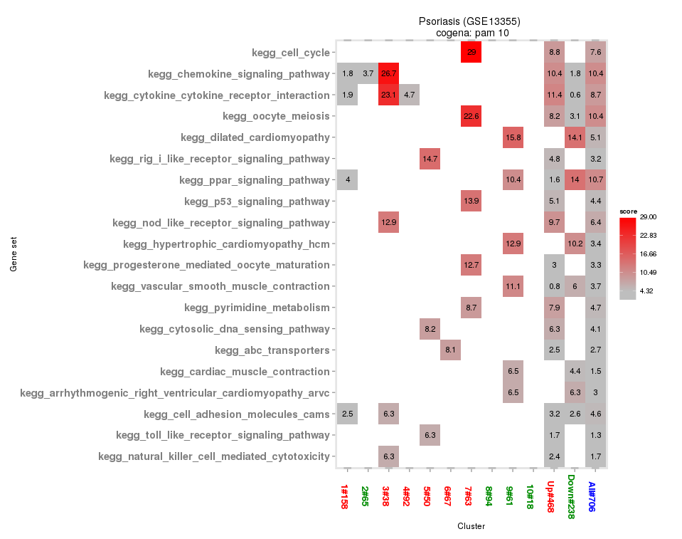

# cogena

To discovery smaller scale, but highly correlated cellular events that may be of great biological relevance, co-expressed gene set enrichment analysis, cogena, aims to cluster gene expression profiles (coExp) for gene co-expression analysis and then implement enrichment analysis for each clusters (clEnrich) based on hyper-geometric test. The results can be visulised by heatmapCluster and heatmapPEI. Based on different gene sets used, cogena can be used as a tool for pathway analysis, GO enrichment analysis, drug repositioning and so on.

See vignette for the detailed workflow.

The workflow of cogena

The heatmap of co-expressed genes based on pam methods with 7 clusters.

KEGG pathway analysis for 7 clusters, together with Down-regulated, Up-regualted and All DE genes. The values shown is the -log2(FDR).

Drug repositioning analysis for the 4th cluster.

Installation:

	devtools::install_github("zhilongjia/cogena")

Acknowledgement:

cogena was originally based on the [clValid](http://cran.r-project.org/web/packages/clValid/index.html) package.

