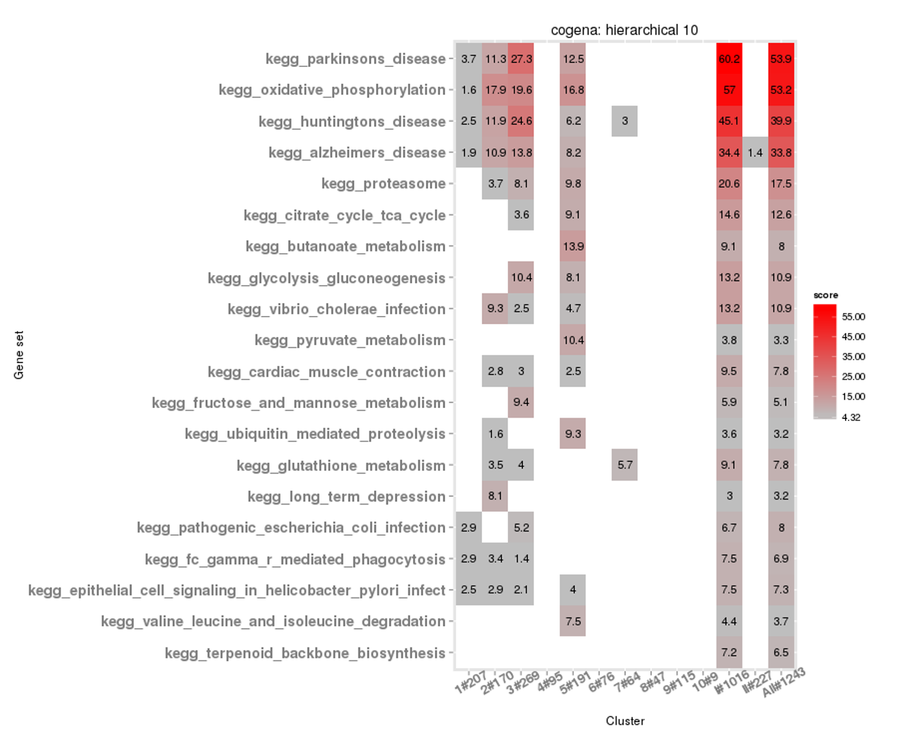

# cogena

**Update:**
+ [cogena](http://www.bioconductor.org/packages/release/bioc/html/cogena.html) was released at Bioconductor.

co-expressed gene-set enrichment analysis: clustering differentially expressed 
genes and gene set enrichment analysis of highly correlated genes within clusters

The workflow of cogena

The heatmap of co-expressed gene set enrichment analysis

The heatmap of co-expressed gene set

installation:

	devtools::install_github("zhilongjia/cogena")

