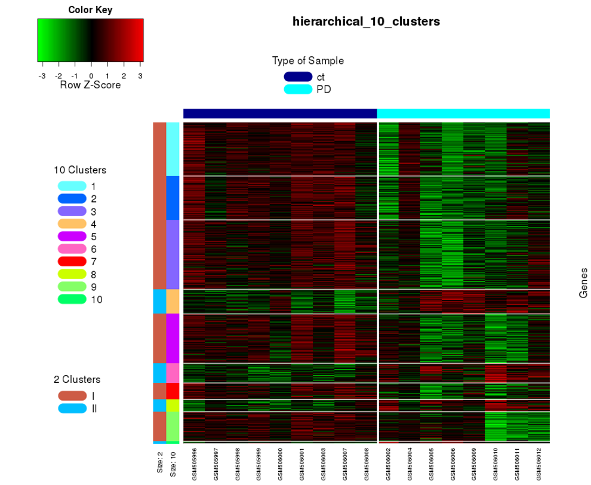

# cogena

co-expressed gene-set enrichment analysis: clustering differentially expressed 
genes and gene set enrichment analysis of highly correlated genes within clusters

")

installation:

	devtools::install_github("zhilongjia/cogena")

