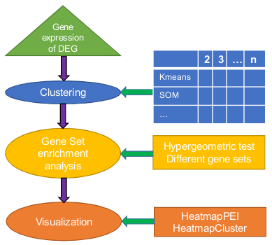

# Abstract

**Co**-expressed **g**ene-set **en**richment **a**nalysis, cogena, is a 
workflow for gene set
enrichment analysis of co-expressed genes. The cogena worklow (Figure 1) proceeds
from co-expression analysis using a range of clustering methods, through to gene
set enrichment analysis based on a range of pre-defined gene sets. Cogena can be
applied to a number of different analytical scenarios dependent on the gene set used.
Currently cogena is pre-built with gene sets from Msigdb and Connectivity Map,
allowing pathway analysis and drug repositioning analysis respectively, the user can
also add custom genes sets to expand analytical functionality further.




The following sections outline a typical example of the cogena workflow, describing
the input data and typical analysis steps required for pathway analysis and drug
repositioning analysis.


```{r opts_chunk, echo=FALSE, results="hide"}
knitr::opts_chunk$set(cache=TRUE, cache.path="../../tmp/", 
                      fig.width=10, fig.height=10, fig.path="../../tmp/")
```

# A quick start
See examples using the `?cogena` command in R.

# Data Input
    Note: all the gene names should be gene SYMBOLs since they are used in
    the gene set files. Other kinds of gene identifiers can be used
    according to the identifiers used in the user-defined gene-set files.


## Input data required

- A set of differentially expressed genes: These should be in a matrix with genes
in rows and samples in columns, data.frame or ExpressionSet object.
- The sample labels indicating the labels, like control and disease, of each sample.
A vector with sample names.


## Example dataset

The `cogena` package has an example dataset, from the NCBI GEO database
[GSE13355](http://www.ncbi.nlm.nih.gov/geo/query/acc.cgi?acc=GSE13355). 
The samples are derived from lesional and non-lesional skin of
psoriasis patients. There are two objects in the Psoriasis dataset. 
See `?Psoriasis` for more details.


```{r import_data, message=FALSE}
library(cogena)
data(Psoriasis)
# objects in the Psoriasis dataset.
# Note: label of interest should follow the control label as this
# will affect the direction of gene regulation.
# For instance use factor (c("Normal", "Cancer", "Normal"),
# levels=c("Normal", "Cancer")), instead of factor(c("Normal",
# "Cancer","Normal")) since "Cancer" is the label of interest.


```

```{r PD_data, echo=TRUE}
ls()
```

# Various Analyses

##  What kind of analysis can be done?

**The gene set used determines the type of analysis.**

There are a variety of gene sets in the `cogena` package, partly collected
from [MSigDB](http://www.broadinstitute.org/gsea/msigdb/index.jsp) 
and [CMap](connectivitymap.org/cmap). Gene sets are summarized in Table 2.

Table 2. Cogena Gene Sets

Gene Set                           | Description
-----------------------------------|---------------
c2.cp.biocarta.v5.0.symbols.gmt.xz | Biocarta gene sets
c2.cp.kegg.v5.0.symbols.gmt.xz     | KEGG gene sets
c2.cp.reactome.v5.0.symbols.gmt.xz | Reactome gene sets
c2.cp.v5.0.symbols.gmt.xz          | all canonical pathways
c5.bp.v5.0.symbols.gmt.xz          | GO biological processes
c5.mf.v5.0.symbols.gmt.xz          | GO molecular functions
CmapDn100.gmt.xz                   | Connectivity map gene sets: top 100 down regulated per drug
CmapUp100.gmt.xz                   | Connectivity map gene sets: top 100 up regulated per drug


User-defined gene-sets must be formatted gmt and/or compressed by xz, (such as
c2.cp.kegg.v5.0.symbols.gmt or c2.cp.kegg.v5.0.symbols.gmt.xz). 
Gene sets should be copied to the extdata directory
in the installation directory of cogena, such as ~/R/x86_64-pc-linux-gnu-
library/3.2/cogena/extdata in Linux), or kindly send to the author of cogena to
share with others.


## Types of analyses
* Pahtway Analysis
* GO Analysis
* Drug repositioning
* User defined


# Pathway Analysis

Firstly, KEGG Pathway Analysis, will be demonstrated to show the utility of cogena.
The other analyses based on cogena are similar to the process of pathway analysis.
Here we used the KEGG pathway gene set (c2.cp.kegg.v5.0.symbols.gmt.xz),
hierarchical and Pam clustering methods, 10 clusters, 2 CPU cores and "correlation"
distance metric to set up the pathway analysis.


## Parameter setting
```{r gene_list_annotation}

# KEGG Pathway gene set
annoGMT <- "c2.cp.kegg.v5.0.symbols.gmt.xz"
# GO biological process gene set
# annoGMT <- "c5.bp.v5.0.symbols.gmt.xz"
annofile <- system.file("extdata", annoGMT, package="cogena")

# the number of clusters. It can be a vector.
# nClust <- 2:20
nClust <- 10
# Making factor "Psoriasis" behind factor "ct" means Psoriasis Vs Control
# is up-regualted
sampleLabel <- factor(sampleLabel, levels=c("ct", "Psoriasis"))

# the number of cores.
# ncore <- 8
ncore <- 2

# the clustering methods
# clMethods <- c("hierarchical","kmeans","diana","fanny","som","model",
# "sota","pam","clara","agnes") # All the methods can be used together.
clMethods <- c("hierarchical","pam")


# the distance metric
metric <- "correlation"

# the agglomeration method used for hierarchical clustering
# (hierarchical and agnes)
method <- "complete"

```

## Cogena running

There are two steps for cogena analysis, co-expression analysis and then 
gene set enrichment analysis (here is pathway anlysis).


```{r cogena, results="hide"}
# Co-expression Analysis
genecl_result <- coExp(DEexprs, nClust=nClust, clMethods=clMethods, 
                       metric=metric, method=method, ncore=ncore)

# Enrichment (Pathway) analysis for the co-expressed genes
clen_res <- clEnrich(genecl_result, annofile=annofile, sampleLabel=sampleLabel)
```


## Results of pathway analysis
###  Summary of cogena result

After completing the cogena analysis, the user can use `summary` to see the
summary of the result of cogena. And `enrichment` caculates the enrichment 
score of certain clustering methods and certain numbers of cluster.


Cogena does not automatically set the clustering method or the number of clusters.
Here we show some principles to guide the user towards optimal selection of
method and number of clusters:


+ Different clusters should account for different gene sets.
+ A gene set should enriched only in one cluster but not two or more.
+ The number of genes in a gene set enriched cluster should be the smallest small
possible to achieve the highest enrichment score.


```{r cogena_result_analysis}
summary(clen_res)
```

```{r enrichment}
# Here we consider the "pam" method and 10 clusters.
# Always make the number as character, please!
enrichment.table <- enrichment(clen_res, "pam", "10")
```

###  Heatmap of expression profiling with clusters

`heatmapCluster` is developed to show the co-expression of differentially expressed
genes. Figure 2 produced by `heatmapCluster` is an enhanced heatmap with 
co-expression information. Moreover, it is obvious to know which cluster contains 
up-regulated or down-regulated genes based on the colour.


```{r heatmapCluster, fig.width=10, fig.height=7, fig.cap="Heatmap of expression profiling with clusters"}
# Always make the number as character, please!
heatmapCluster(clen_res, "pam", "10", maintitle="Psoriasis")
```

### Enrichment heatmap of co-expressed genes 

`heatmapPEI` can be used to show the enrichment graph. See Figure 3.
See `?heatmapPEI` for more details. Many parameters are configurable, while
generally the default will be fine.


```{r heatmapPEI, fig.width=11, fig.height=7, fig.cap="KEGG pathway enrichment"}
# The enrichment score for 10 clusters, together with Down-regulated,
# Up-regulated and All DE genes. The values shown in Figure 2 is the -log2(FDR).
#
# Always make the number as character, please!

heatmapPEI(clen_res, "pam", "10", printGS=FALSE, maintitle="Pathway analysis for Psoriasis")

```
Figure 3 shows the pathway enrichment for each cluster as well as up-regulated,
down-regulated and all the differentially expressed genes. The enrichment scores
can be ranked by a certain cluster or the max or average scores of all the scores for
each pathway.


# Drug repositioning

Pathway analysis demonstrates that specific disease pathways are often
represented by a single cluster. Accordingly, we recommend that drug repositioning
is performed based on co-expressed gene clusters instead of all the differentially
expressed genes. If the input of cogena is disease related data, the drugs enriched
should recover the gene expression changed by the disease (the drug should induce
an opposite direction in expression to the disease), while if the input is drug related,
the enriched drugs should show similar gene expression changes caused by the drug
studied. Here we show drugs for treating psoriasis, an autoimmune disease.


## Drug repositioning analysis running

The drug repositioning gene set choice of _CmapDn100.gmt.xz_ or _CmapUp100.gmt.xz_
should be made based on the regulation direction of clusters. For example, as the
7th cluster contains up-regulated genes for psoriasis, the _CmapDn100.gmt.xz_ is
chosen for drug repositioning of psoriasis to recover the gene expression changes
caused by the disease.

```{r drp}
# A comprehensive way
# cmapDn100_cogena_result <- clEnrich(genecl_result, 
# annofile=system.file("extdata", "CmapDn100.gmt.xz", package="cogena"), 
# sampleLabel=sampleLabel)

# A quick way
# Based on the pathway analysis results
cmapDn100_cogena_result <- clEnrich_one(genecl_result, "pam", "10", 
    annofile=system.file("extdata", "CmapDn100.gmt.xz", package="cogena"), 
    sampleLabel=sampleLabel)
```

## Original result of drug repositioning

Showing the results ordered by the 7th cluster in Figure 5. The parameter
`orderMethod` is used to order the results.
```{r drp_figure, fig.width=10, fig.height=7, fig.cap="Drug repositioning"}
heatmapPEI(cmapDn100_cogena_result, "pam", "10", printGS=FALSE, 
           orderMethod = "7", maintitle="Drug repositioning for Psoriasis")

# Results based on cluster 5.
# heatmapPEI(cmapDn100_cogena_result, "pam", "10", printGS=FALSE, 
#           orderMethod = "5", maintitle="Drug repositioning for Psoriasis")

# Results based on cluster 9, containing down-regulated genes.
# heatmapPEI(cmapUp100_cogena_result, "pam", "10", printGS=FALSE, 
#           orderMethod = "9", maintitle="Drug repositioning for Psoriasis")

```

## Multi-instance merged result of drug repositioning

Usually there is more than one instance for a drug with different doses or 
time-points in the Cmap gene set. `heatmapCmap` can merge the multi-instance results
based on parameter _mergeMethod_ ("mean" or "max"). Figure 6 shows the 
multi-instance merged results ordered by the 7th cluster.

```{r drp_figure2, fig.width=10, fig.height=7, fig.cap="Drug repositioning (multi-instance merged)"}
heatmapCmap(cmapDn100_cogena_result, "pam", "10", printGS=FALSE, 
            orderMethod = "7", maintitle="Drug repositioning for Psoriasis")
```

##  Other useful functions

### Querying genes in a certain cluster

The user can obtain the genes in a certain cluster via `geneInCluster` , enabling other
analyses, such as drug target identification.

```{r geneInCluster}
# Always make the number as character, please!
geneC <- geneInCluster(clen_res, "pam", "10", "4")
head(geneC)

```

###  Gene expression profiling with cluster infromation

It can be obtained by `geneExpInCluster`. There are two items, 
`clusterGeneExp` and `label`, in the returned object of `geneExpInCluster`. 
It can be used for other application.
```{r geneExpInCluster}
# Always make the number as character, please!
gec <- geneExpInCluster(clen_res, "pam", "10")
gec$clusterGeneExp[1:3, 1:4]
gec$label[1:4]
```

### The gene correlation in a cluster

The correlation among a cluster can be checked and visulised by `corInCluster`. See Figure 4.
```{r corInCluster, fig.width=6, fig.height=6, fig.cap="Correlation of genes in a cluster"}
# Always make the number as character, please!
corInCluster(clen_res, "pam", "10", "10")
```

# Bug Report

https://github.com/zhilongjia/cogena/issues

# Citation

Jia Z. et al. *Cogena, a tool for co-expressed gene-set enrichment 
analysis and visualization*.

# Other Information

System info
```{r sessionInfo, echo=FALSE}
sessionInfo()
```

